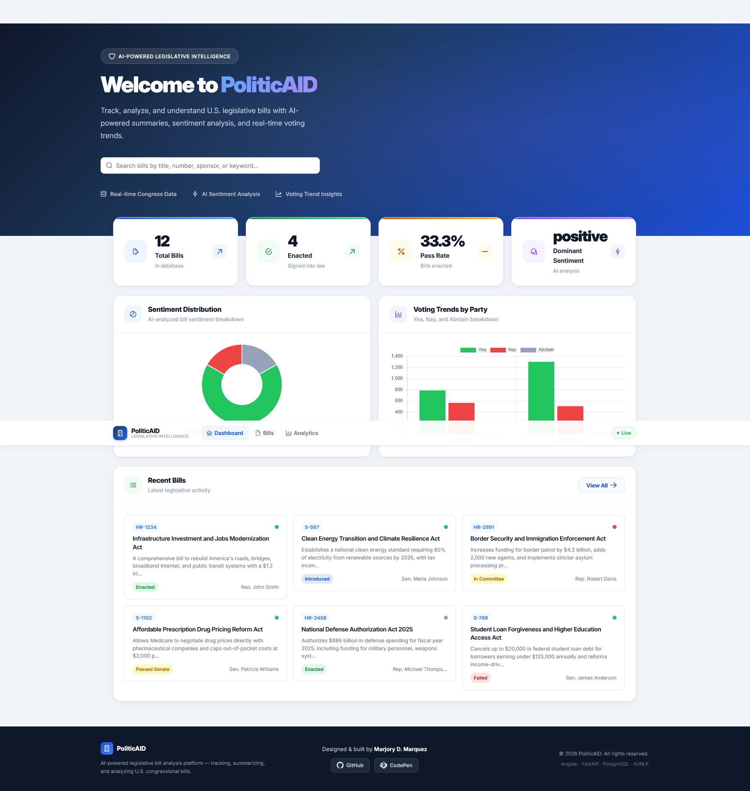
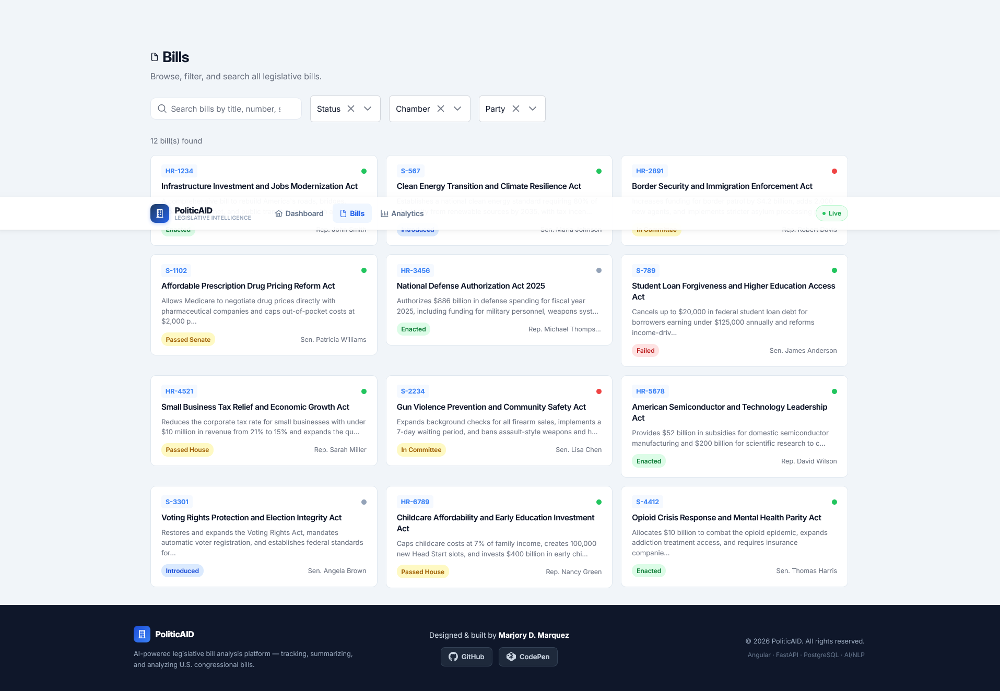

# 🏛️ PoliticAId — AI Legislative Insight Platform

<div align="center">

**Using artificial intelligence to analyze and explore legislative information**


</div>

---

# Overview

**PoliticAId** is a full-stack platform designed to collect, analyze, and visualize legislative data using modern web technologies and natural language processing.

The system processes legislative text and transforms it into structured insights such as:

- AI-generated summaries
- sentiment indicators
- extracted keywords
- entity recognition
- analytical trends

These insights are presented through an interactive web dashboard that enables exploration and analysis of legislative information.

---

# Preview Images Project




---

# Core Objectives

PoliticAId focuses on three main objectives:

- Transform complex legislative text into structured insights
- Provide tools for exploring and analyzing legislation
- Demonstrate applied AI and modern full-stack engineering

The platform combines data ingestion, natural language processing, and visualization into a unified system.

---

# Key Capabilities

### Legislative Data Processing

- ingestion of legislative content from external sources
- structured storage of bill metadata and analysis results
- indexing and organization of legislative records

### AI Text Analysis

- automated document summarization
- sentiment classification
- keyword extraction
- named-entity recognition

### Interactive Exploration

- searchable legislative records
- filtering and browsing by metadata
- analytical dashboards and visualizations

### API Layer

- RESTful API endpoints
- structured JSON responses
- modular backend architecture

---

# Project Structure

The system is organized into three primary components.

```
politicaid/
├── backend/        # FastAPI backend services and AI processing
├── frontend/       # Angular web application
├── infra/          # container and infrastructure configuration
├── scripts/        # utility and setup scripts
├── docker-compose.yml
├── .gitignore
└── README.md
```

---

# System Architecture

### Frontend

Single-page application built with **Angular**, providing:

- dashboards and analytics views
- legislative search interface
- bill detail pages
- interactive visualizations

### Backend

Backend services built with **FastAPI**, responsible for:

- API routing
- business logic
- data access
- integration with NLP analysis

### Data Layer

A **PostgreSQL** database stores legislative records and analytical outputs generated by the platform.

### AI Processing Layer

Natural language processing components analyze legislative text to generate:

- summaries
- sentiment scores
- extracted entities
- keywords

---

# Data Processing Flow

```
Legislative Data Sources
        ↓
Data Ingestion
        ↓
NLP Analysis Pipeline
        ↓
Structured Data Storage
        ↓
FastAPI REST API
        ↓
Angular Web Interface
```

---

# Technology Stack

## Frontend

- Angular
- TypeScript
- RxJS
- PrimeNG
- Chart.js

## Backend

- Python
- FastAPI
- SQLAlchemy
- Pydantic
- Alembic

## Natural Language Processing

- Hugging Face Transformers
- PyTorch
- spaCy
- scikit-learn
- NLTK

## Infrastructure

- PostgreSQL
- Redis
- Docker
- Docker Compose

---

# Engineering Focus

This project highlights several areas of software engineering:

- full-stack architecture
- REST API design
- integration of AI models into web applications
- database modeling and structured data storage
- containerized development environments
- modular backend services
- interactive frontend dashboards

---

# Security Notes

Sensitive configuration values and credentials are not included in this repository.

Security practices include:

- environment-based configuration
- exclusion of secrets from source control
- separation of development and runtime configuration
- controlled access to external APIs

---

# Future Development

Potential future improvements include:

- additional legislative datasets
- expanded analytics capabilities
- advanced AI-assisted exploration tools
- enhanced visualization modules
- additional API endpoints

---

# License

```
Copyright (c) 2024 Marjory Marquez

All rights reserved.

No part of this software may be reproduced, distributed, or used
without explicit permission from the author.
```

---

# Author

**Marjory D. Marquez**  
GitHub: https://github.com/Marjory00

---

**PoliticAId — AI-driven exploration of legislative information**